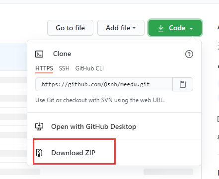
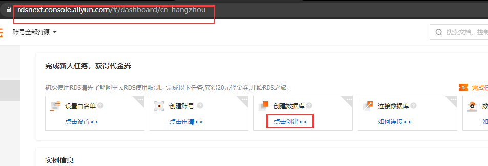
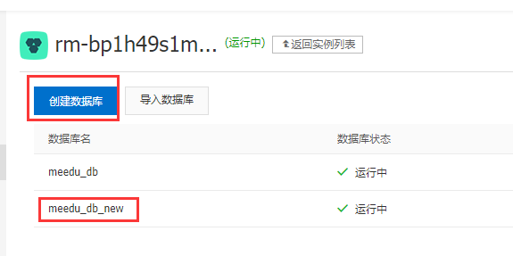
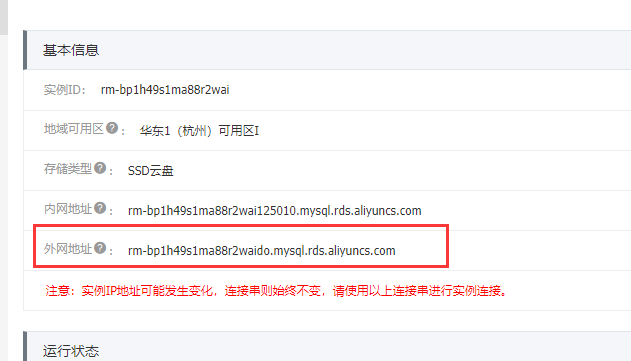
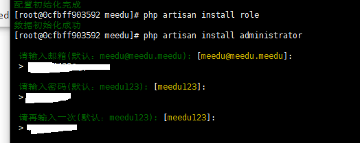
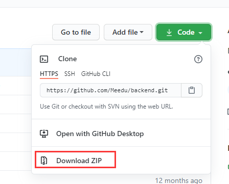
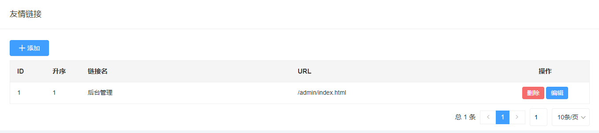

-   只需要运行前面不带`# `的

# 0 安装mysql5.7

-   可以不弄，那样的话就要去云数据库rds里面创建数据库了

```bash
yum install wget -y
wget https://dev.mysql.com/get/mysql57-community-release-el7-9.noarch.rpm
rpm -ivh mysql57-community-release-el7-9.noarch.rpm
yum install mysql-server -y
systemctl start mysqld

# 找到初始密码
grep 'temporary password' /var/log/mysqld.log
2020-04-11T07:53:15.951160Z 1 [Note] A temporary password is generated for root@localhost: g(wfb5Nhf.2L

# 登录修改密码
mysql -u root -p
# 设置安全级别为最低
set global validate_password_policy=0;
ALTER USER 'root'@'localhost' IDENTIFIED BY '******';

# 远程访问：(可以不需要)
# use mysql;
# update user set Host='%' where User='root';
# grant all privileges on *.* to root@"%" identified by "******";
# flush privileges;

exit;

# 配置默认编码为utf8(可以不需要)
# vim /etc/my.cnf
# 添加 [mysqld] 下面
# [mysqld]
# character_set_server=utf8 
# init_connect='SET NAMES utf8'

# 重启/设置开机启动(可以不需要)
# systemctl restart mysqld
# systemctl enable mysqld 
```

# 1 安装docker

```bash
# 通过 uname -r 命令查看你当前的内核版本
uname -r
# 确保 yum 包更新到最新
yum update -y

# 卸载旧版本(如果安装过旧版本的话)
yum remove docker  docker-common docker-selinux docker-engine

# curl -fsSL https://get.docker.com | bash -s docker --mirror Aliyun

sudo yum install -y yum-utils \
  device-mapper-persistent-data \
  lvm2

sudo yum-config-manager \
    --add-repo \
    http://mirrors.aliyun.com/docker-ce/linux/centos/docker-ce.repo
    
sudo yum install docker-ce docker-ce-cli containerd.io -y

# 启动 Docker
sudo systemctl start docker
# 运行测试
sudo docker run hello-world
```

## 1.1 Docker 安装 CentOS7

```bash
# 镜像加速器
sudo mkdir -p /etc/docker
sudo tee /etc/docker/daemon.json <<-'EOF'
{
  "registry-mirrors": ["https://u5cxohu5.mirror.aliyuncs.com"]
}
EOF
sudo systemctl daemon-reload
sudo systemctl restart docker

# 安装 CentOS7
docker pull centos:centos7
```

# 2 用docker安装meedu

-   meedu-master.zip文件：`https://github.com/Qsnh/meedu`



```bash
cd ~
mkdir centos-ev
# 这个目录上传文件 meedu-master.zip
yum install -y zip
unzip meedu-master.zip
mv meedu-master meedu

# 之后文件互通在现实的服务器下的
# `~/centos-env/`文件夹下与docker里面的`/otherfile`的文件夹下

# 启动 Docker CentOS7
#  --privileged=true  特权模式
docker run -itd -p 80:80 -v /root/centos-env/:/otherfile --name meedu-docker centos:centos7

# 查看容器id
docker ps

# 进入meedu-docker
docker exec -it 0cfbff903592 /bin/bash
```

## 2.1 安装php7.2

```bash
# 安装php7.2
yum install epel-release -y
rpm -Uvh https://mirror.webtatic.com/yum/el7/webtatic-release.rpm

yum -y install php72w php72w-cli php72w-fpm php72w-common php72w-devel php72w-embedded php72w-gd php72w-mbstring php72w-mysqlnd php72w-opcache php72w-pdo php72w-xml
# 慢，等20分钟左右
```

## 2.2 安装meedu

```bash
# 安装meedu
cd /otherfile/meedu

# Composer
php -r "copy('https://install.phpcomposer.com/installer', 'composer-setup.php');"
php composer-setup.php
php -r "unlink('composer-setup.php');"
mv composer.phar /usr/local/bin/composer
composer selfupdate

# 忽略版本匹配
composer install --no-dev --ignore-platform-reqs
cp .env.example .env

# 生成JWT秘钥：
php artisan key:generate
yes
php artisan jwt:secret
yes
```

## 2.3 创建数据库-用云数据库rds

-   如果不去网页创建数据库的话，需要安装mysql的客户端，然后远程连接mysql

```bash
# 链接数据库
# mysql -h ******.aliyuncs.com -u geeki_admin -p
# 输入密码
# Geeki888
# 创建数据库
# create database if not exists meedu_db_new;
# exit;
```

-   地址：`https://rdsnext.console.aliyun.com/#/dashboard/cn-hangzhou`

### 2.3.1 网页创建数据库





### 2.3.2 网页设置ip地址白名单


### 2.3.3 网页申请外网ip位

-    ecs服务器的内网和外网ip



```bash
# 记住下面的东西
# 记住外网地址：******.aliyuncs.com
# 记住数据库名称：meedu_db
# 记住用户名：mysqlusername
# 记住密码：mysqlpassword
```

## 2.4 编辑.env文件

```bash
# 编辑.env文件
yum install vim -y
vim .env

# 修改下面的
DB_CONNECTION=mysql
DB_HOST=******.aliyuncs.com
DB_PORT=3306
DB_DATABASE=meedu_db
DB_USERNAME=mysqlusername
DB_PASSWORD=mysqlpassword
```

## 2.5 进行安装

```bash
# 创建上传目录软链接：
php artisan storage:link
# 设置 `storage` 目录权限为 `777`
chmod -R  0777 storage

# 安装数据表
php artisan migrate
yes

# 初始化系统配置：
php artisan install config

# 初始化系统权限：
php artisan install role

# 初始化管理员：
php artisan install administrator

# 生成安装锁文件
php artisan install:lock
```



### 2.5.1 修改脚标文件

```bash
vim /otherfile/meedu/resources/views/layouts/common/footer.blade.php

# 显示行号
:set nus

# 找到并删除221行 增加下面的
<p>Powered By <a href="/" target="_blank">Shixiedu</a></p>
```

### 2.5.2 修改logs权限文件(还没出问题)

```bash
# cd /otherfile/meedu/storage/logs/
```

## 2.6 安装nginx

```bash
# 安装nginx
rpm -Uvh http://nginx.org/packages/centos/7/noarch/RPMS/nginx-release-centos-7-0.el7.ngx.noarch.rpm
yum install -y nginx

# 配置伪静态并设置 meedu 的运行目录为 `public` 。
vim /etc/nginx/nginx.conf
# 伪静态规则（Nginx）：
# 在http{ }里面增加下面的
server{
        listen       80;
        server_name  meedu;
        root   /otherfile/meedu/public;
        index index.php;
        location / {
                try_files $uri $uri/ /index.php$is_args$query_string;
        }
        location ~ \.php(.*)$  {
            fastcgi_pass   127.0.0.1:9000;
            fastcgi_index  index.php;
            fastcgi_split_path_info  ^((?U).+\.php)(/?.+)$;
            fastcgi_param  SCRIPT_FILENAME  $document_root$fastcgi_script_name;
            fastcgi_param  PATH_INFO  $fastcgi_path_info;
            fastcgi_param  PATH_TRANSLATED  $document_root$fastcgi_path_info;
            include        fastcgi_params;
        }
    }


# 开启nginx
/usr/sbin/nginx -c /etc/nginx/nginx.conf

# 开启php-fpm
php-fpm
```

## 2.7 安装后台管理

-   backend-master.zip文件：`https://github.com/Meedu/backend`



```bash
# 安装后台管理
cd /otherfile/

# 这个目录上传文件 backend-master.zip
unzip backend-master.zip
mv backend-master backend
cd backend

# 安装编译工具，比较慢
yum install -y nodejs
npm config set registry http://registry.npm.taobao.org
npm install -g hey-cli
npm install -g yarn
# 进行编译
yarn install
hey build

# 复制文件到相应目录 meedu/public/ 下
cp -r ./dist /otherfile/meedu/public/
cd /otherfile/meedu/public/
# 删除安装php
rm -rf install.php
# 修改名称为 admin
mv ./dist admin

# 安装完成，下面是后台地址：
# http://ip地址:80/admin/index.html
# 下面是前台地址：
# http://ip地址:80
```

-   可以在友情链接下面设置后台管理链接，那样就可以直接从前台跳转到后台了。



